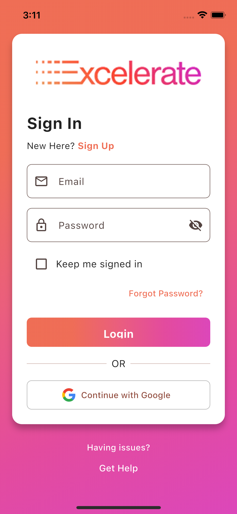
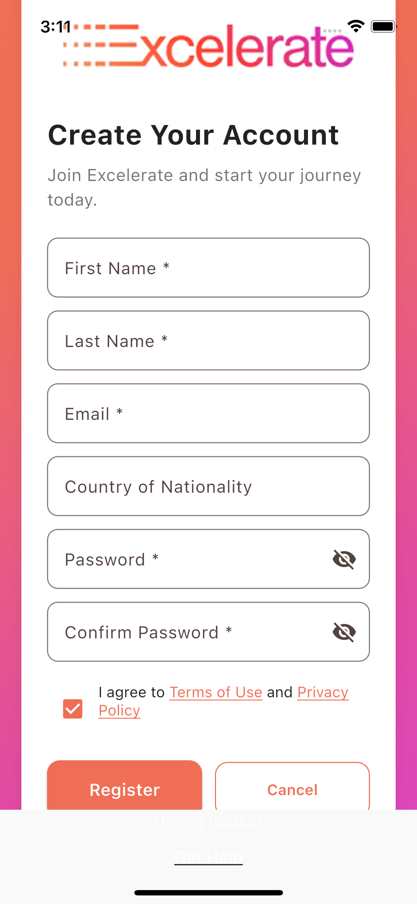
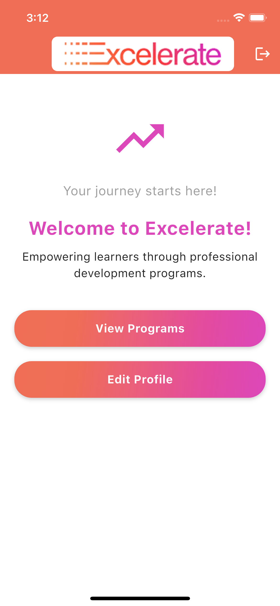
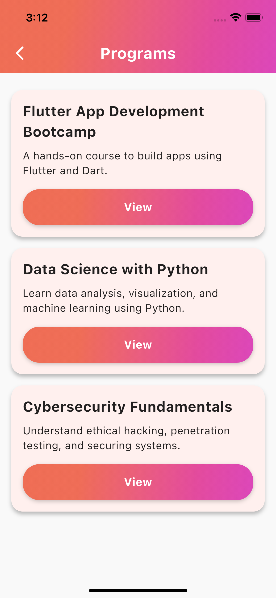
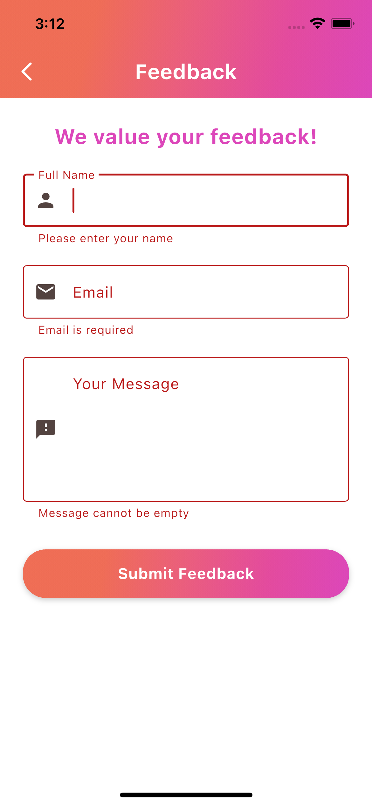

# 🚀 Excelerate App

A cross-platform mobile application built using **Flutter** and **Dart**, developed as part of the *Excelerate Internship Program*.  
The app delivers a clean, branded, and interactive experience — designed following the official wireframes and color scheme.

## 📦 Download APK (Android)

You can download the latest stable build here:

👉 [**Download Excelerate v1.0.0 APK**](https://github.com/ronitghai/Excelerate-App/releases/download/v1.0.0/excelerate_apk_v1.0.1.apk)
(Click to download directly and install on your Android device.)

⚠️ **Note:** iOS version (IPA) is under development and not available yet.

---

## 🧩 Features Implemented

✅ **Custom App Icon** – Replaced default Flutter icon with our new **excelerate_icon** brand logo.  
✅ **Landing / Launch Screen** – Clean introductory screen with app branding.  
✅ **Login Screen** – Fully validated email-password login form.  
✅ **Signup Screen** – User registration form with input validation and terms acceptance.  
✅ **Home Screen** – Serves as the main hub for navigation across app features.  
✅ **Program Listing Screen** – Dynamically loads data from a **mock API (JSON)** instead of static content.  
✅ **Program Details Screen** – Displays complete program info with “Enroll Now” option and success dialog.  
✅ **Feedback Form** – Includes full **form validation** (name, email, message) with mock API submission.  
✅ **Registration Form** – Integrated email and password validation flow.  
✅ **Loading & Error Handling** – Uses Flutter’s `FutureBuilder`, loading indicators, and friendly messages.  
✅ **Consistent Gradient Buttons** – Custom reusable button widget with animated gradient background.  
✅ **Clean Folder Structure** – Organized files under `/screens`, `/theme`, `/widgets`, `/assets/images`.  
✅ **All Comments Removed & Code Polished** – Production-ready version.

---

## 🧭 Navigation Flow

1. **Launch Screen → Login Screen**  
2. **Login → Home Screen**  
3. **Home → Program Listing Screen (API connected)**  
4. **Program Listing → Program Details Screen**  
5. **Program Details → Feedback Form (validated submission)**

All screens are interconnected using `Navigator.push` and maintain smooth, logical transitions throughout the app.

---

## 🎨 Design & Branding

The app follows the **Excelerate Design System**:
- **Primary Colors:** Coral & Deep Purple (as defined in `colors.dart`)  
- **Buttons:** Branded gradient buttons (from `gradients.dart`)  
- **Typography:** Simple, modern, and legible sans-serif fonts  
- **Layout:** Consistent spacing, rounded corners, and responsive scaling  
- **Theme:** Light background for clarity and professional appeal  

---

## 📱 Screenshots

### 🏁 Landing Page
  

### 🔐 Login Screen
  

### 📝 Signup Screen
  

### 🏠 Home Screen
  

### 📋 Program Listing Screen (API Connected)
  

### 📄 Program Details Screen
  

### 📝 Feedback Form
  

---

## 🧰 Tech Stack

- **Framework:** Flutter  
- **Language:** Dart  
- **Platform:** Android & iOS  
- **IDE:** Visual Studio Code  
- **Version Control:** Git & GitHub  

---

Latest Updates (v1.0.0)

- Added custom app icon: excelerate_icon
- Removed all commented code across all Dart files
- Finalized color palette & gradient consistency
- Improved Program Listing API response handling
- Added loading & error states for API screens
- Refined Feedback Form validation and UX flow
- Fixed button paddings, alignment, and text scaling
- Optimized image assets and project folder structure
- Updated README and repository metadata for GitHub

Version

Current Version: v1.0.0
Status: Stable Release (Production Ready)
Next Goal: Add backend connectivity for real-time data & authentication

Developer

Developed by: Ronit Ghai 

Role: Flutter Developer | UI/UX Integrator | API Implementation

Summary

This marks the first stable release (v1.0.0) of the Excelerate App —
a fully functional Flutter-based cross-platform app built with clean design, validated forms, mock API integration, and a polished UI aligned with the brand identity.
